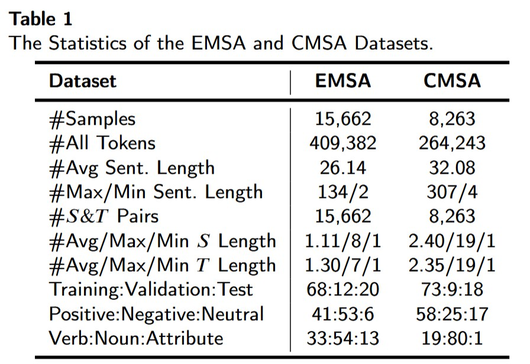
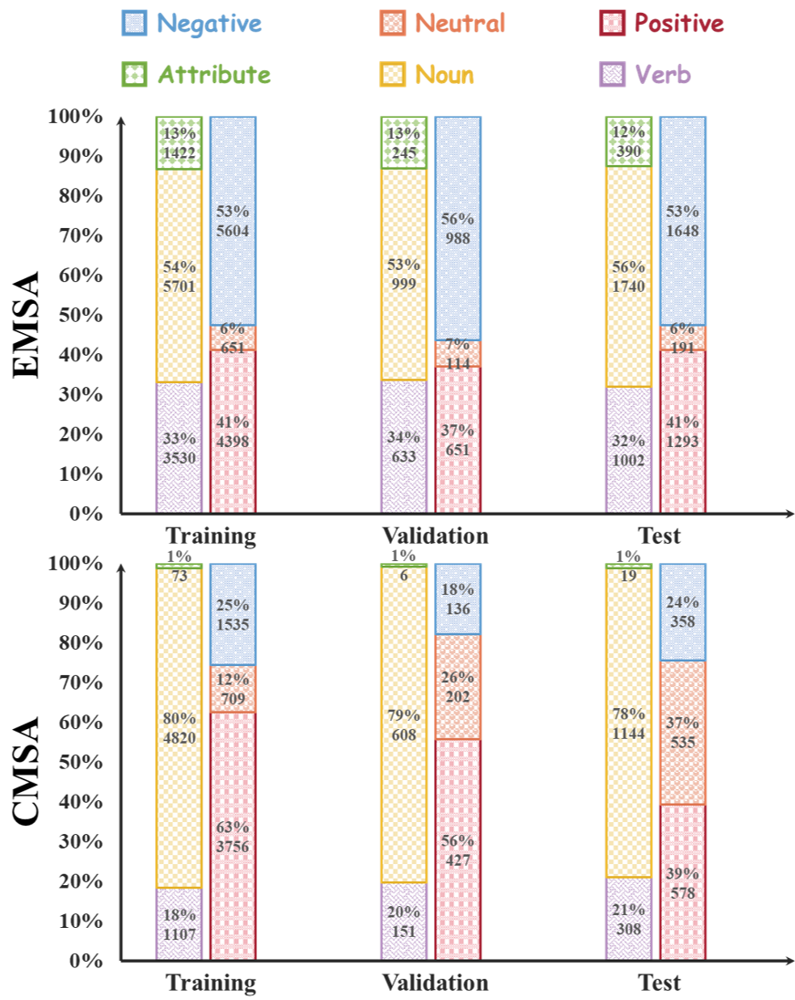
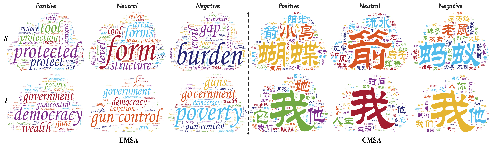
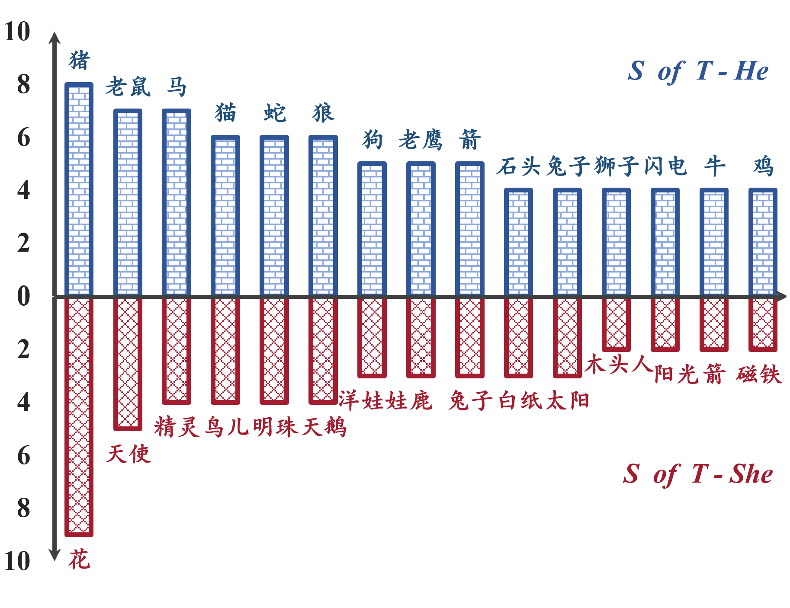

# EMSA & CMSA Datasets

## 📖 Overview
This repository contains two bilingual, multi-type metaphor sentiment analysis datasets, all dataset with annotated source domains (**S**), target domains (**T**), metaphor type, and sentiment polarity:  

- **EMSA (English Metaphor Sentiment Analysis)**  
  A reconstructed English dataset based on the LCC dataset.  

- **CMSA (Chinese Metaphor Sentiment Analysis)**  
  A manually re-annotated Chinese dataset based on the CSR and CMRE dataset, designed to fill the gap in metaphor sentiment research for Chinese.   

---

## 📂 Dataset Structure
Each dataset file is in `.json` format with the following key-value:

| Key            | Description                                                                 |
|-------------------|-----------------------------------------------------------------------------|
| **ID**            | Unique identifier for each instance                                         |
| **Input**          | Original sentence containing metaphorical expression                        |
| **S (Source)**    | Source domain word(s)                                                       |
| **T (Target)**    | Target domain word(s)                                                       |
| **Type** | Type of metaphor (e.g., Noun, Verb, Attribute) |
| **Output**      | Sentiment polarity label (positive, negative, neutral)                      |

---

## 📊 Statistics
| Dataset | Language | Size (sentences) | Annotation Dimensions |
|---------|----------|------------------|------------------------|
| EMSA    | English  | 15,662          | S, T, metaphor type, sentiment polarity |
| CMSA    | Chinese  | 8,263           | S, T, metaphor type, sentiment polarity |

---

## 📊 Data Analysis
We provide figures analyzing the datasets from cultural and linguistic perspectives.  
Examples include co-occurrence of sentiment and metaphor type, high-frequency $S$ and $T$, and gender-based $S$ distributions.  

You can find all analysis figures in the repository under the `docs/figures/` folder.  

Example figure link:

#### Basic Statistics


#### Distribution of Labels across Subsets


#### Co-occurrence of Sentiment and Metaphor Types
 

#### High-frequency S and T across Different Sentiment Polarities


#### Gender-Based Patterns in Metaphors


---

## ⚙️ Usage
To load the dataset in Python:

```python
import json

with open("EMSA/train.json", "r", encoding="utf-8") as f:
    emsa_train = json.load(f)

with open("CMSA/train.json", "r", encoding="utf-8") as f:
    cmsa_train = json.load(f)

print(emsa_train[0])
print(cmsa_train[0])
```

<!-- ## 📜 Citation

If you use EMSA or CMSA in your research, please cite:

@article{YourPaper2025,
  title   = {Multi-type Metaphor Sentiment Analysis across English and Chinese},
  author  = {Your Name et al.},
  journal = {Journal Name},
  year    = {2025}
} -->

## 🤝 Contact

For questions or collaboration, please contact:

Hongde Liu ( lhd_1013@163.com )
